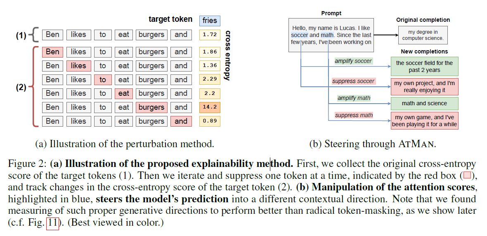
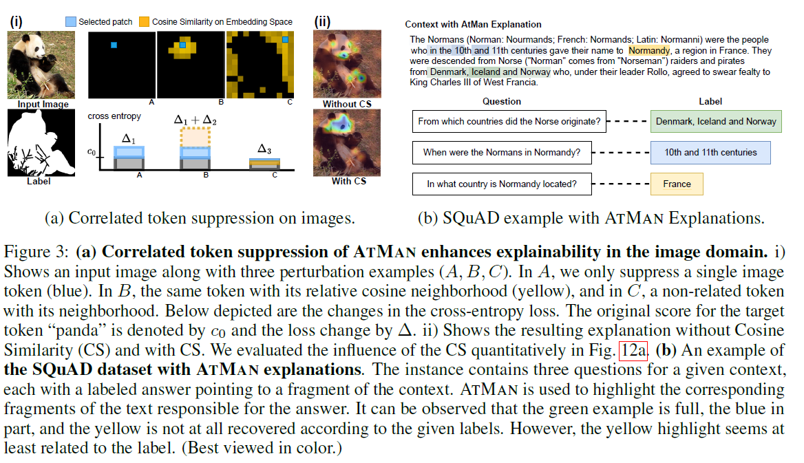
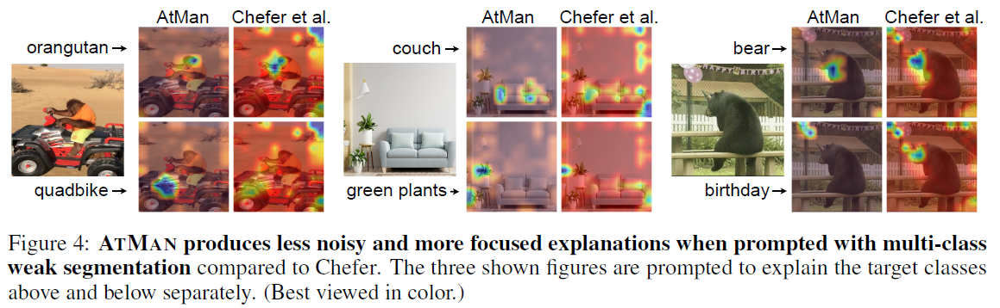
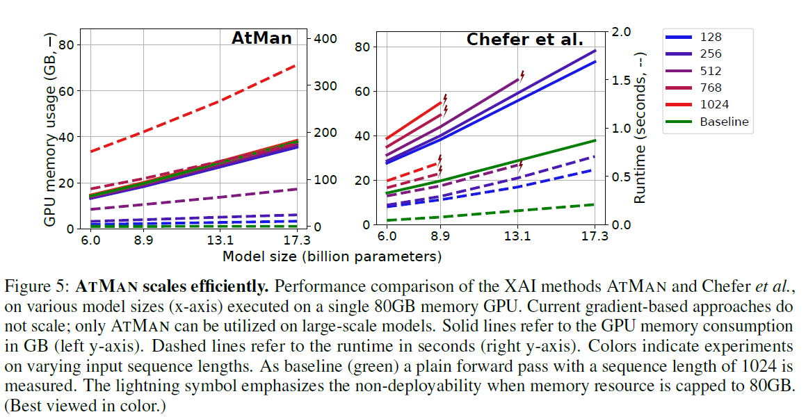
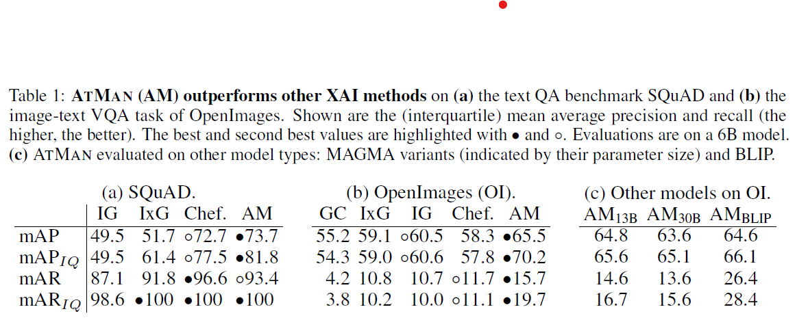

# AtMan- XAI on generative models

AtMan is an explainability method designed for multi-modal generative transformer models. It correlates the relevance of the input tokens to the generated output by exhaustive perturbation. To obtain the score values, it applies ATtention MANipulation throughout all layers, and measures the difference in the resulting logprobs on the target tokens.
It further encorporates embedding similarity to surppress the entire entropy found at once.
As depicted in following examples, one is able to highlight various discriminative features on the same input, i.p. on text as well as image-modality.


[Paper Link](https://arxiv.org/abs/2301.08110)


## prelim
This repo includes the XAI methods AtMan, Chefer, and a Captum interface for IG, GradCam etc. for the language-model GPT-J and vision-language model [MAGMA](https://github.com/Aleph-Alpha/magma) and [BLIP](https://colab.research.google.com/github/salesforce/BLIP).

To install all required dependencies, run the following command, e.g. in a conda environment with python3.8:
```
bash startup-hook.sh
```

# examples
## image-text/ MAGMA
TODO: examples for different methods (script + image)
```
cd atman-magma
python example_explain_panda.py
run plot_panda.ipynb
```

## image-text/ BLIP

## text/ GPT-J


# more to read










