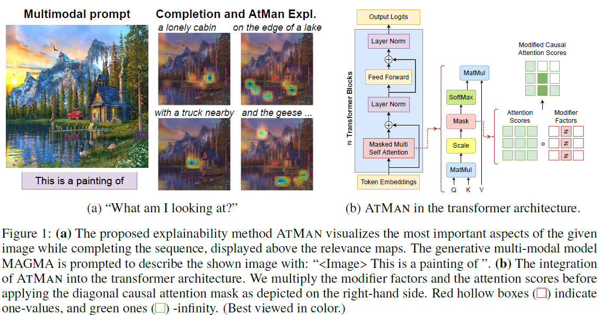

# AtMan- XAI on generative models

AtMan is a explainability method on transformer based language models. It correlates the relevance of the input tokens to the generated output by exhaustive probing. To obtain the score values, it applies ATtention MANipulation throughout all layers, and measures the difference in the resulting logprobs on the target tokens.
As such, following belows examples, one is able to highlight discriminative features, e.g. on Images, when applying on multi-modal models.




[Paper Link](https://arxiv.org/abs/2301.08110)


## how-to
This repo includes the XAI methods AtMan, Chefer, and a Captum interface for IG, GradCam etc. on the language-model GPT-J and vision-language model [MAGMA](https://github.com/Aleph-Alpha/magma) and [BLIP](https://colab.research.google.com/github/salesforce/BLIP).

To run install all required dependencies, run the following command, e.g. in a conda environment with python3.8:
```
bash startup-hook.sh
```

# examples
## image-text/ MAGMA
```
python example_explain_panda.py
run plot_panda.ipynb
```

## image-text/ BLIP

## text/ GPT-J
